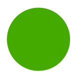
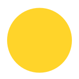

# Sortenliste

Für diese Sorten liegen bereits **ausreichend** Bilder vor. Weitere Bilder dieser Sorten bitte nur nach Absprache. Die Icons zeigen an ob sehr viele  oder gerade ausreichend  Bilder verfügbar sind.

- Adersleber Kalvill 
- Prinz Albrecht von Preußen  
- Alkmene 
- Transparent aus Croncels 
- Auralia 
- Baumanns Renette 
- Goldrenette Freiherr von Berlepsch 
- Brettacher 
- Carola 
- Charlamovsky		
- Damason Renette 
- Danziger Kantapfel 
- Dülmener Rosenapfel 
- Erbachhofer	Mostapfel 
- Gasconyes Scharlachroter 
- Gelber Bellefleur 
- Gelber Richard 
- Gloster 
- Goldparmäne 
- Helios 
- Ingrid Marie 
- Jakob Fischer 
- Jakob Lebel 
- James Grieve 
- Kaiser Wilhelm 
- Kanadarenette 
- Klarapfel 
- Landsberger Renette 
- Minister von Hammerstein 
- Ontario 
- Pinova 
- Piros 
- Rebella 
- Rheinischer Bohnapfel 
- Riesenboiken 
- Rote Sternrenette 
- Schöner aus Herrnhut 
- Schöner aus Boskoop 
- Spartan 
- Weißer Winterglockenapfel 

Stand: 24-06-30
